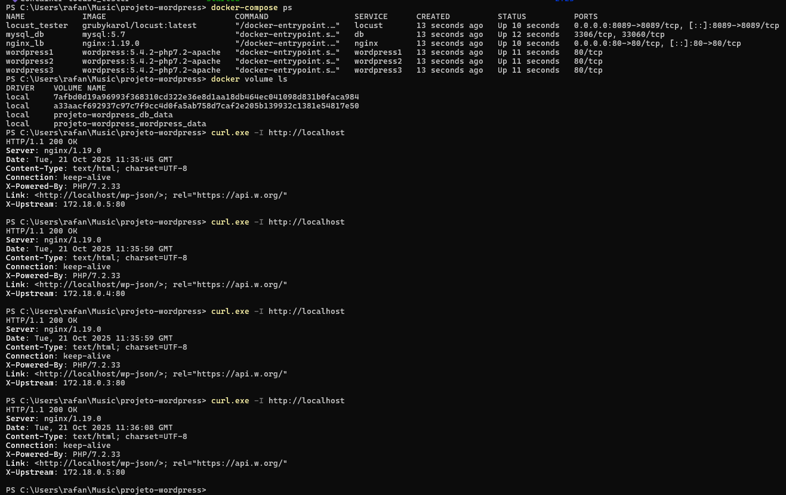
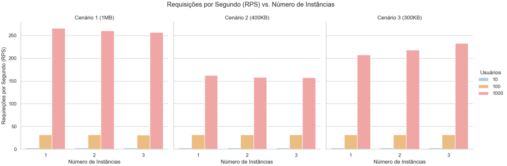
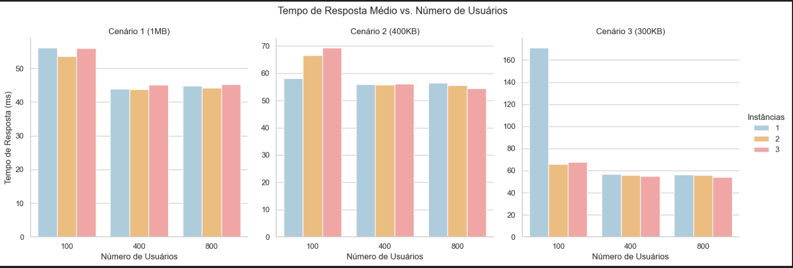

# Projeto WordPress Escalável com Nginx e Docker Compose

## Sobre o Projeto

Este projeto implementa uma arquitetura WordPress de alta disponibilidade usando Docker Compose. Um servidor **Nginx** atua como **balanceador de carga**, distribuindo o tráfego entre **três instâncias do WordPress**, todas conectadas a um único banco de dados **MySQL**.

- **Escalabilidade:** O tráfego é dividido entre múltiplos servidores.
- **Tolerância a Falhas:** Se uma instância do WordPress falhar, o site continua online.
- **Segurança:** Apenas o Nginx é exposto, protegendo os outros serviços.

---

## 🚀 Iniciar o Ambiente
Para iniciar todos os contêineres em segundo plano:

```bash
docker-compose up -d
```

Após a execução, acesse o site em:  
👉 [http://localhost](http://localhost)

---

## 🔍 Comandos de Verificação

### Verificar o status dos contêineres:
```bash
docker-compose ps
```

### Listar volumes criados pelo Docker:
```bash
docker volume ls
```

### Testar o balanceamento de carga
(No PowerShell, use `curl.exe`)

```powershell
curl.exe -I http://localhost
```

> 💡 **Observação:** O endereço de IP no cabeçalho `X-Upstream` deve mudar a cada execução.

---

## 🧰 Comandos para Solução de Erros

### Ver logs de um serviço específico (ex: nginx):
```bash
docker-compose logs nginx
```

### Inspecionar um contêiner para ver detalhes e IP:
```bash
docker inspect wordpress1
```

---

## 🧹 Parar e Limpar o Ambiente

### Parar os contêineres (mantendo os dados do site):
```bash
docker-compose down
```

### Resetar o projeto completamente (**APAGA TODOS OS DADOS**):
```bash
docker-compose down -v
```

## Demonstração

A imagem abaixo mostra o ambiente Docker em execução com Nginx, WordPress e MySQL funcionando corretamente:



## Testes de Carga Automatizados com Locust

Esta seção descreve como executar a suíte de testes de carga (baseado no **"Trabalho 3"**) para avaliar o desempenho da arquitetura.

O objetivo é executar um total de **27 testes**, combinando **3 variáveis**:

---

### ⚙️ 3 Cenários de Conteúdo
- Imagem de **1MB**  
- Texto de **400KB**  
- Imagem de **300KB**

### 🖥️ 3 Configurações de Servidor
- 1 instância do WordPress  
- 2 instâncias do WordPress  
- 3 instâncias do WordPress

### 👥 3 Níveis de Carga
- 10 usuários simultâneos  
- 100 usuários simultâneos  
- 1000 usuários simultâneos  

---

## ⚙️ Configuração das Instâncias do WordPress

Os testes devem ser realizados variando o número de **instâncias do WordPress**:  
**1, 2 e 3 instâncias.**

Para isso, é necessário **editar o arquivo `docker-compose.yml`** e o **arquivo de configuração do Nginx** (`nginx.conf`), descomentando as seções conforme o número de instâncias desejado.

### 🧱 Exemplo de Estrutura no `docker-compose.yml`

Abaixo está o exemplo com as **3 instâncias ativas**:

```yaml
wordpress1:
  image: wordpress:5.4.2-php7.2-apache
  container_name: wordpress1
  depends_on:
    - db
  environment:
    WORDPRESS_DB_HOST: db:3306
    WORDPRESS_DB_USER: wordpressuser
    WORDPRESS_DB_PASSWORD: wordpresspassword
    WORDPRESS_DB_NAME: wordpress
  volumes:
    - wordpress_data:/var/www/html
  networks:
    - app-network

wordpress2:
  image: wordpress:5.4.2-php7.2-apache
  container_name: wordpress2
  depends_on:
    - db
  environment:
    WORDPRESS_DB_HOST: db:3306
    WORDPRESS_DB_USER: wordpressuser
    WORDPRESS_DB_PASSWORD: wordpresspassword
    WORDPRESS_DB_NAME: wordpress
  volumes:
    - wordpress_data:/var/www/html
  networks:
    - app-network

wordpress3:
  image: wordpress:5.4.2-php7.2-apache
  container_name: wordpress3
  depends_on:
    - db
  environment:
    WORDPRESS_DB_HOST: db:3306
    WORDPRESS_DB_USER: wordpressuser
    WORDPRESS_DB_PASSWORD: wordpresspassword
    WORDPRESS_DB_NAME: wordpress
  volumes:
    - wordpress_data:/var/www/html
  networks:
    - app-network
```

Para testar apenas 1 instância, mantenha somente o serviço wordpress1 e comente os outros dois (wordpress2 e wordpress3).

---

### 🌐 Configuração do Nginx

No arquivo nginx/nginx.conf, há o bloco que define o balanceamento de carga entre as instâncias:

```yaml
upstream wordpress {
    server wordpress1;
    server wordpress2;
    server wordpress3;
}
```

Durante os testes, comente/descomente as linhas conforme o número de instâncias:
- 1 instância: apenas server wordpress1;
- 2 instâncias: server wordpress1; e server wordpress2;
- 3 instâncias: mantenha as três linhas ativas.

## 🧠 Seleção do Cenário de Teste no Locust

Além de variar o número de instâncias, cada rodada de teste deve utilizar um dos **3 cenários de conteúdo**:

| Cenário   | Descrição         | Arquivo Locust   |
|------------|-------------------|------------------|
| Cenário 1  | Imagem de ~1MB    | `scenario1.py`  |
| Cenário 2  | Texto de ~400KB   | `scenario2.py`  |
| Cenário 3  | Imagem de ~300KB  | `scenario3.py`  |

---

### ⚙️ Configuração no `docker-compose.yml`

Para selecionar o cenário desejado, atualize o serviço **`locust`** no arquivo `docker-compose.yml`:

```yaml
locust:
  image: grubykarol/locust:latest
  container_name: locust_tester
  ports:
    - "8089:8089"
  environment:
    - ATTACKED_HOST=http://nginx
    - LOCUST_FILE=/locust/scenario3.py   # <-- Altere aqui para o cenário desejado
  volumes:
    - ./locust-scripts:/locust
  networks:
    - app-network
  depends_on:
    - nginx
  restart: unless-stopped
```

## 👥 Níveis de Carga no Locust

Os testes também variam conforme o número de **usuários simultâneos** e a **taxa de geração (spawn rate)**.  
Esses parâmetros podem ser ajustados diretamente no comando de execução do **Locust** ou no próprio código de cenário.

| Nível de Carga | Usuários Simultâneos (`--users`) | Taxa de Geração (`--spawn-rate`) |
|----------------|----------------------------------|----------------------------------|
| Baixo          | 10                               | 1                                |
| Médio          | 100                              | 10                               |
| Alto           | 1000                             | 100                              |

---


## 🧪 Demonstração

A imagem abaixo mostra os gráficos gerados



